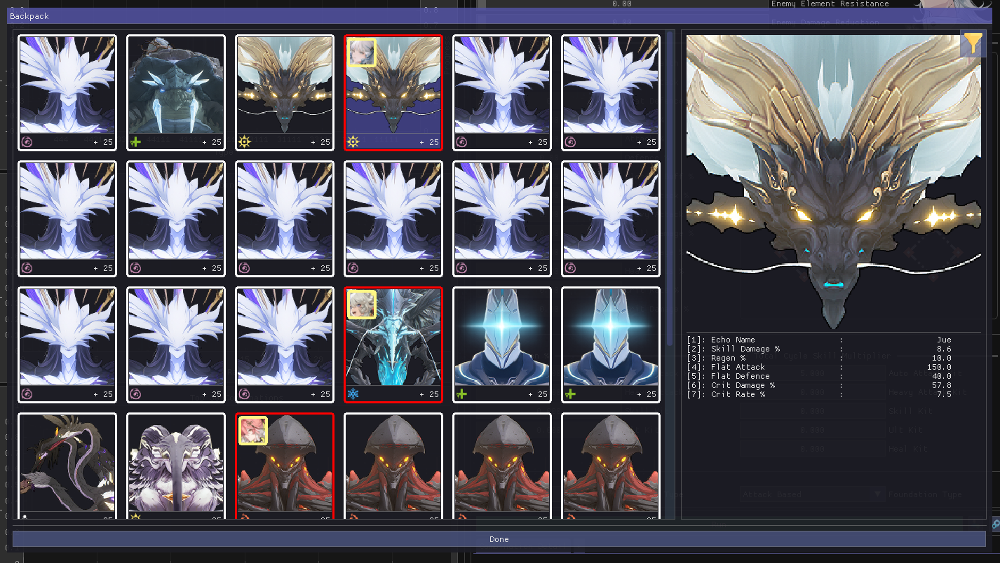
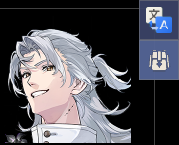

# Backpack

     

You can enter the backpack window clicking the backpack icon on top right   

- If an echo has red frame, it will no be used by the optimizer
  - If it's equipped by another character, it's disable automatically
    - You can un-equip the echo by double-clicking on the overlaying character icon on that echo
  - You can toggle the availability of an echo by double-clicking on it
- You can filter echo set by the filter icon on top right