# Optimizer

> The optimizer is optimizing an "Optimizing Value", which is defined as
> $$\text{Expected Damage} + \text{Healing}$$

## Calculation

     

### Constraints

> Clicking on the right most blue gear icon will open the constraints edit window

    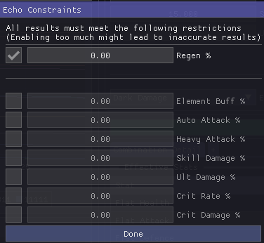 

Click on the checkbox on left of a row will enable constraint for that specific stat

### Echo Equip

> After selected a combination (more on below), pressing the blue people icon will put the selected combination on the character (within optimizer), this will automatically disable the usage of those echoes for other character

    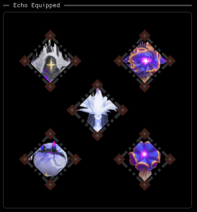 

- Double-click on the echo in "Echo Equipped" section to unequip it

---

> Having all the data [setup](opt_input.md), pressing the run button will start the calculation

### Overview

    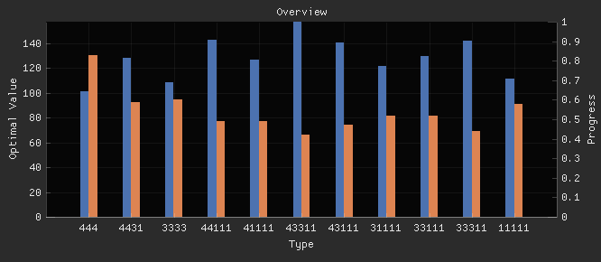 

- Orange Bar
  - The calculation progress of the specific combination class (43111, 44111)
- Blue Bar
  - The most uptodate maximum optimizing value of the specific combination class (43111, 44111)

### Top Combination By Class/Type

    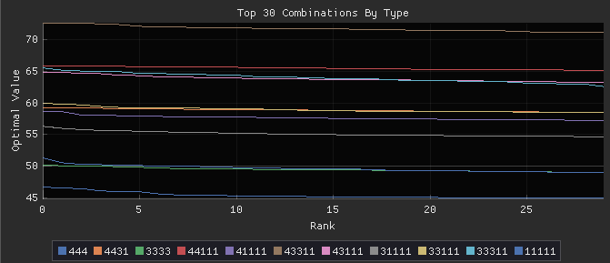 

- X-Axis
  - Rank within class with left being top of the class (Rank 0)
- Y-Axis
  - Optimizing Value

#### Interaction

- You can hover your mouse on the graph to view a specific combination
- Scroll to zoom
- Right click for more settings
- Left click to select/pin a combination on right
  - Hover on another combination to view the different after selection   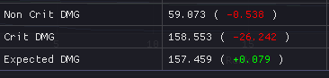
- Click the legend on the bottom to hide/show a certain class/type of combination

### Top Combination With Combined Class/Type

    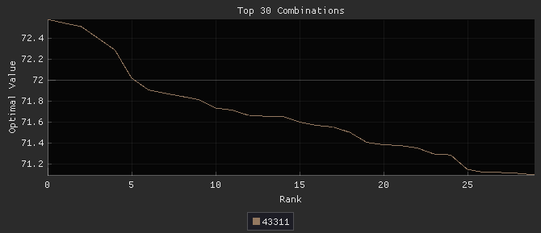 

Same as **Top Combination By Class/Type** but reflect the top combination out of all class/type

## Detailed Combination Result

After you selected/hovered on a combination, you should find the following table

    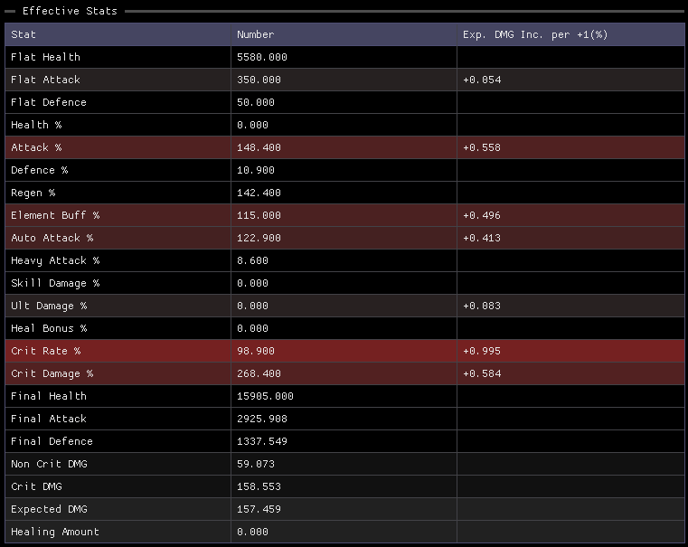 

1. The optimizer is sorting/ranking combinations based on the **SUM OF** last two row (Optimizing Value)
2. The redder the row, the more you can improve the final Optimizing Value by increasing it
   - This is also explicitly shown on the last column
   - This is what you should aim for when hunting for new echo

---

You should also find the actual combination

    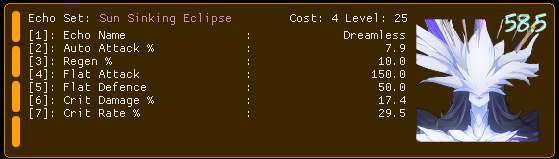 

- Detailed stats of the echo
- Score of the echo on top right (100/green being perfect, 0/red being useless)   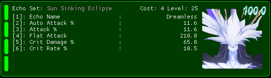

## Combination Tweak

> This feature is for finding the potential of new/substitution echo from a specific combination
> 
> e.g. "Should I use attack/elemental main stat"

    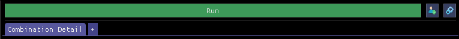 

After selected a combination, click on the + button right to the "Combination Detail" tab to start new tweak tab

Pick one echo to replace/tweak

    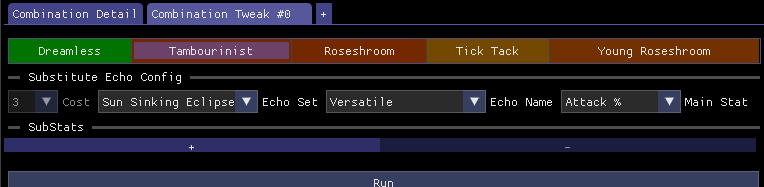 

After putting in the static detail of the new echo, click run to see the potential

---

### Potential Optimizing Value Distribution

    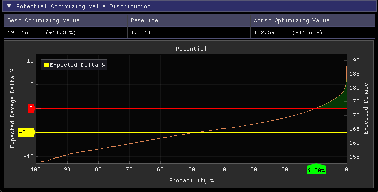 

- Best Optimizing Value
  - Given the config, if keep upgrading, what is the maximum Optimizing Value after replacing the selected echo
- Baseline
  - Current Optimizing Value
- Worse Optimizing Value
    - Given the config, if keep upgrading, what is the minimum Optimizing Value after replacing the selected echo
- Yellow Horizontal Line
    - Given the config, if keep upgrading, what is the expected Optimizing Value percentage change from Baseline after replacing the selected echo
    - This is defined/placed so that the **AREA** under the line are equal on both side, not just at 50%
- Red Horizontal Line & Green Arrow on X-Axis
    - Given the config, if keep upgrading, what is the probability(Green Arrow) of getting Y%(Red Line) improvement from Baseline after replacing the selected echo
    - The Red Line is draggable

### Key Expected Information

> This section sum up the key information from "**Potential Optimizing Value Distribution**" section

    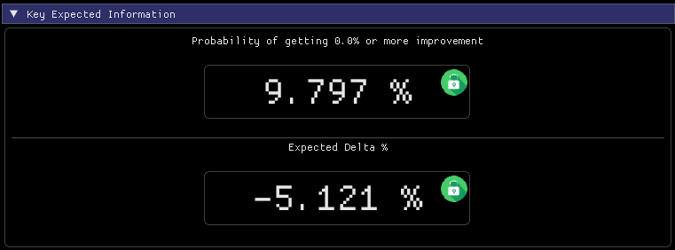 

- Probability of getting X% or more improvement
  - This is the Green Arrow's value from "**Red Horizontal Line**"
- Expected Delta %
  - Value of "**Yellow Horizontal Line**"
- Lock
  - You can lock the value to see changes after editing tweak config (Still need to run the tweaker to update)

### "Result"

    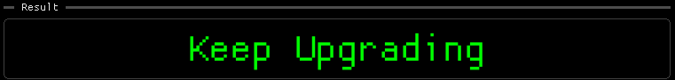 

- Keep Upgrading
  - Upgrading will yield more XP to improvement value
- Stop Upgrading
  - Using this echo to level up another echo will yield more XP to improvement value

### Substats

    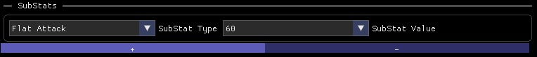 

You can add/remove substat to update the potential