# Optimizer

## Data input

### Statis Configurations (Optional)

> These configs **WILL NOT** affect the ordering of combinations

Having the correct static config will yield correct damage number, but finding top combination does not require any input in this section

    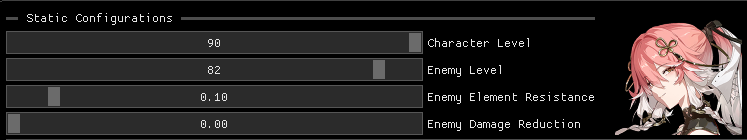 

### Overall Stats

> These configs reflect the character's stats **WITHOUT** character **HIMSELF** wearing echoes

    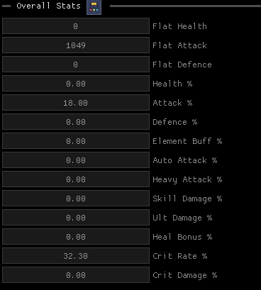 

#### The Overall Stats Should Reflect
- Character
  - Base Health, Attack, Defence Stats (Found on character level-up/ascend page or **WHITE NUMBER** in character detail page)
   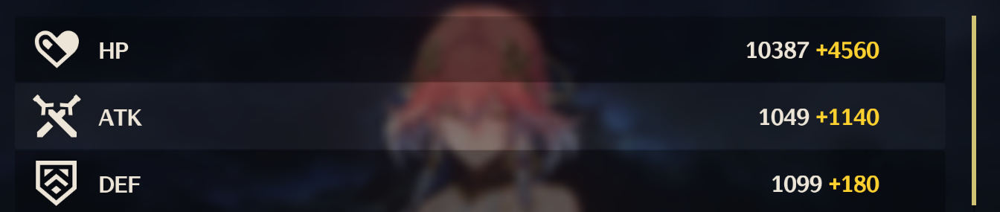
  - ~~Default Crit Rate (5%)~~ **DO NOT PUT IN**
  - ~~Default Crit Damage (150%)~~ **DO NOT PUT IN**
  - Forte Stats (Fourth Tab)
  - Resonance Stats (Fifth Tab)
- Weapon
  - All number you see
  - ⚠️ If you are using the white number from character detail page _instead of_ level-up/ascend page as Base Stats, you should ignore the main stat from weapon as it's included in character detail

    

- Any other buffs
    - Other team member's buffs applying on this character
    - Other team member's echo buffs applying on this character
    - Tower buffs
    - ...

#### Input Guide

1. Click on the button next to "Overall Stats" to enter the detail page  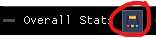
2. Enter the composition name. This is use useful to separate different buff, so you can backtrack or **DEACTIVATE** (by the blue button) certain buff to test different team comp   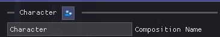
3. Flat/Base Stat, as described above, should **ONLY** be found on character himself and weapon's main stat   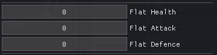
4. Health, Attack, Defence % Stats from anywhere   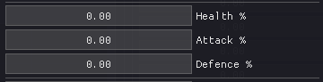
5. Different Multipliers from anywhere   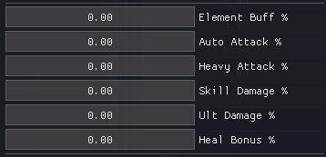
   - For "Element Buff %" you should only put in the element buff that the character is using
     - e.g. For Changli it is Fire
       - If you found an Ice element buff, do not put in
6. Crit Stats from anywhere   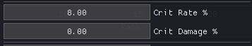
   - ⚠️ **DO NOT PUT IN** default Crit Stat (5%, 150%)
7. Deepen Stats from anywhere   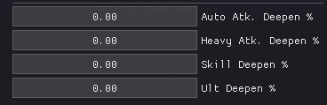
   - You know it is deepen when you see the keyword "**Amplified**". e.g. You put 15 in all four deepen stats with Verina's outro skill   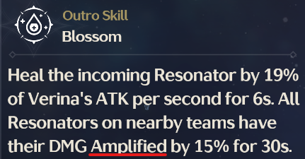
8. (Optional) Click on the green bar on right to add and red bar to pop composition

### Total Cycle Skill Multiplier

> The optimizer will rank combination by the following config.

    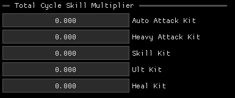 

- If your character does very little e.g. heavy attack damage, you can leave heavy attack kit empty

- If your character rely on both _Auto Attack_ and _Ult_ damage heavily, you should put in both, as the optimizer will consider the ratio of different damage and rank combination by the maximum total damage output

- If you know how much each kit contributes to the final damage, don't care the actual damage calculation but only ranking, you can simply enter that ratio
  - e.g. For Jinhsi it's roughly 1:2 ult:skill, you can simply put 1 and 2 in the corresponding slot

You can found and **SUM UP** (skill that you use/care) skill multipliers on character's Forte page
- ⚠️ only multiplier (%) are supported, if the damage / heal is in the form of XXX + YYY%, just use YYY

    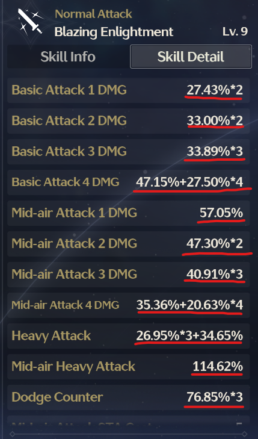 

### Element type

> Element that the character is using to deal damage. Also defines what is the element of "Element Buff %" under Overall Stats

    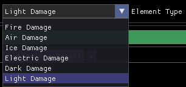 

### Foundation Type

> Defines what percentage does "Skill Multiplier" based off of

    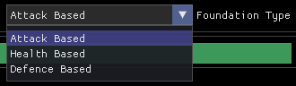 

For most character it is default Attack, but for some character
- Shorekeeper's Heal is based off of HP (Health)   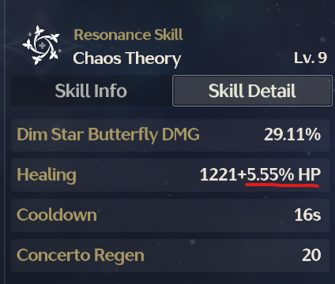
- Taoqi's Ult is based off of DEF (Defence)   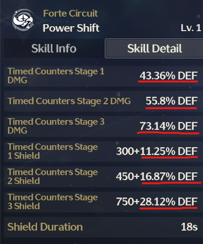
- ⚠️ Yes you can't calculate properly if a character use more than one Foundation