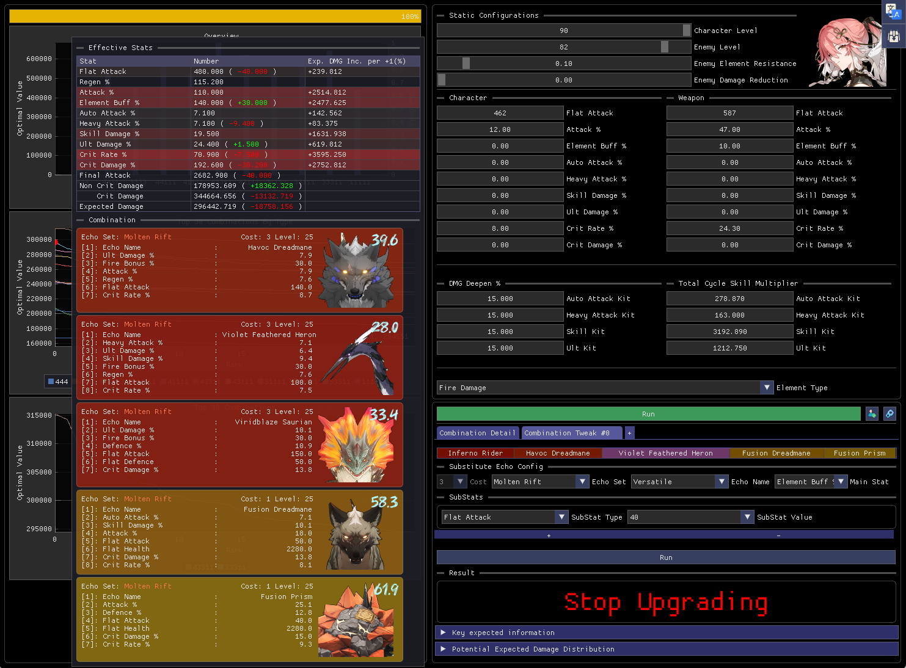
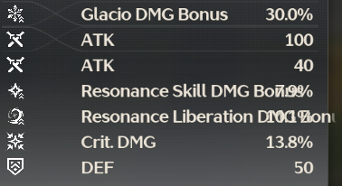
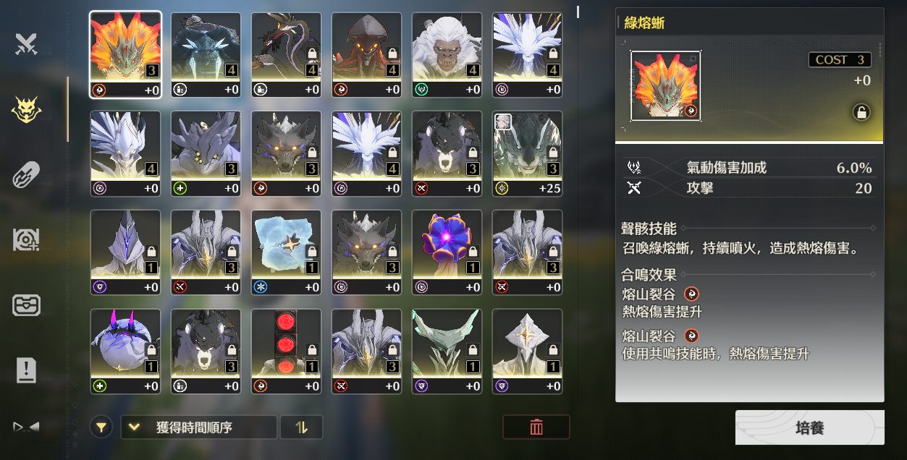
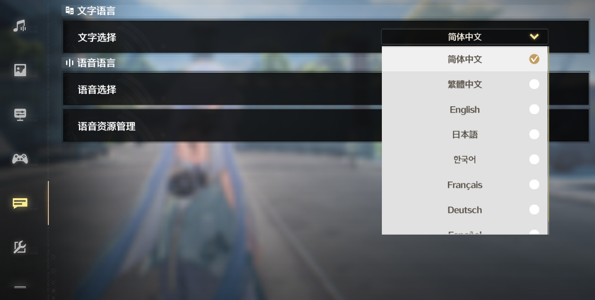

> ⚠️ This project is still under development
# Usage

## Echo Optimizer

### To launch

#### From command line with custom echo storage

```bash
WuWaOptim.exe "path to echoes.yaml"
```

See [echo file example](data/example_echos.yaml)

#### From File Explorer

As long as the scanner and the optimizer are located **in the same folder and you had ran the scanner**, you can start the optimizer by double-clicking on it in File Explorer

### To Use

See [Optimizer Input](data/usage/opt_input.md)

See [Optimizer Calculation](data/usage/opt_calculate.md)

See [Optimizer Echo Backpack/Storage](data/usage/opt_backpack.md)

## Echo Scanner

1. Go to the echo page in you backpack (press b), scroll to the top
2. Run `WuWaScan.exe` as administrator as Wuthering Waves also runs as administrator
3. Enter the number of echoes to scan
4. Enter the scan delay
5. Wait (You can terminate the scanning process with space bar)

> ⚠️Your Windows Display Scaling must be set to 100%\
> ⚠️Only support 1920x1080 in Simplified Chinese until Kuro fix this, or I have motivation to implementing echo scanning in character page\
> \
> Your echo page should look like the following **(4 by 6)**\
> 

> Simplified Chinese
> 

# Build from source

## Tools for compiling
- git
- cmake
- vcpkg
- Microsoft Visual C++
    - tested on 17.10.4

## Configuring
```bash
git clone https://github.com/EMCJava/WuWaOpt.git
cd WuWaOpt && mkdir build && cd build
```

Replace `PATH_TO_VCPKG` to the root directory of vcpkg
```bash
cmake -DCMAKE_TOOLCHAIN_FILE=PATH_TO_VCPKG/scripts/buildsystems/vcpkg.cmake ..
```

## Compiling & Running

### Echo Scanner

```bash
cmake --build . --target WuWaScan --config Release
cd .. && build\WuWaScan\Release\WuWaScan.exe
```

### Echo Optimizer
```bash
cmake --build . --target WuWaOptim --config Release
cd .. && build\WuWaOptim\Release\WuWaOptim.exe
```
