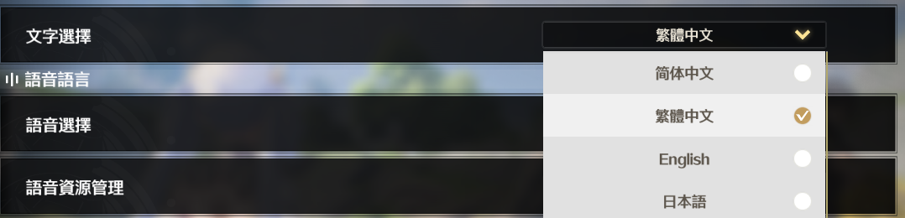

> ⚠️ This project is still under development
# Usage

## Echo Optimizer
```bash
WuWaOptim.exe "path to echos.json"
```
See [echo file example](data/example_echos.json)

## Echo Scanner
```bash
WuWaScan.exe
```
> ⚠️ Only support 1280x720 in Traditional Chinese until Kuro fix this, or I have motivation to implementing echo scanning in character page\
> 

> Traditional Chinese
> 

# Build from source

## Tools for compiling
- git
- cmake
- vcpkg
- Microsoft Visual C++
    - tested on 17.10.4

## Configuring
```bash
git clone https://github.com/EMCJava/WuWaOpt.git
cd WuWaOpt && mkdir build && cd build
```

Replace `PATH_TO_VCPKG` to the root directory of vcpkg
```bash
cmake -DCMAKE_TOOLCHAIN_FILE=PATH_TO_VCPKG/scripts/buildsystems/vcpkg.cmake ..
```

## Compiling & Running

### Echo Scanner

```bash
cmake --build . --target WuWaScan --config Release
cd .. && build\WuWaScan\Release\WuWaScan.exe
```

### Echo Optimizer
```bash
cmake --build . --target WuWaOptim --config Release
cd .. && build\WuWaOptim\Release\WuWaOptim.exe
```